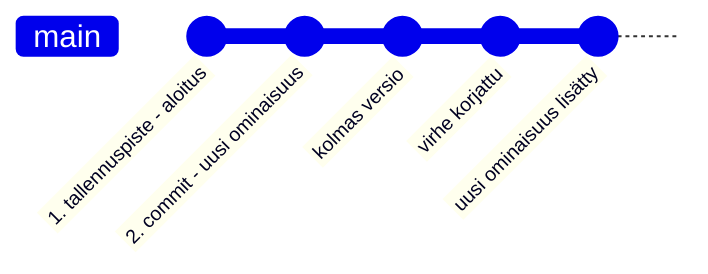
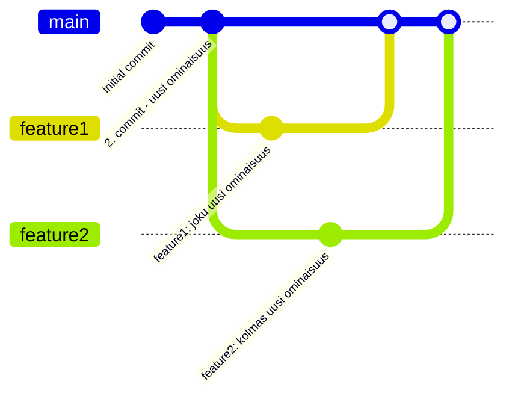
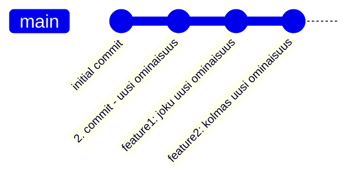

# Versionhallinta

Versionhallintajärjestelmä on sovellus, joka tallentaa ja hallitsee ohjelmistoprojektin eri versioita. Sen keskeisiä ominaisuuksia ja hyötyjä on mm.:

- Tarkka muutosseuranta, jonka avulla voi vastata kysymyksiin:
  - Mitä on muuttunut edellisestä versiosta? 
  - Miksi muutos tehtiin?
  - Milloin se tapahtui?
  - Kuka sen teki?
- Rinnakkainen kehitystyö: mahdollistaa useiden eri ominaisuuksien tai korjausten kehittämisen ohjelmistoon samanaikaisesti ilman, että kehittäjät häiritsevät toistensa työtä.
- Tehokas yhteistyö: mahdollistaa projektin koodin ja sen koko kehityshistorian jakamisen, mikä on välttämätöntä tiimityössä.
- Versioiden vertailu ja palautus: Voit helposti vertailla nykyistä versiota mihin tahansa aiempaan versioon, seurata kehityksen kulkua ja tarvittaessa palata vanhoihin versioihin.
- Varmuuskopiointi: Jaettu/hajautettu versionhallinta voi toimia samalla myös projektin varmuuskopiona, suojaten työtä katoamiselta.
- Koodin laadun varmistaminen: Järjestelmä on ratkaisevassa roolissa koodin laadun ylläpitämisessä ja kehitysprosessin sujuvuudessa.

Käytännössä versionhallinta on välttämätön työkalu ammattimaisessa ohjelmistokehityksessä. Sitä käyttävät kaikenkokoiset organisaatiot ja tiimit varmistaakseen tehokkaan projektinhallinnan.

Versionhallintajärjestelmiä on useita, joista tunnetuimpia ovat Git, Subversion ja Mercurial. Näistä Git on nykyään yleisin ja laajimmin käytetty, ja siksi keskitymme tässä osiossa pääosin sen käyttöön ja toimintaperiaatteisiin, vaikka monet konseptit ovat samankaltaisia myös muissa työkaluissa.

Käytännössä versionhallinta voidaan nähdä ohjelmiston kehityksen aikajanana, johon tallennetaan kaikkialle koodiin tehtyjä muutoksia sopivin väliajoin.

Tallennuspisteitä kutsutaan nimillä "commit", "revision" tai "version" hieman järjestelmästä riippuen. Aikajanaa kutsutaan taas usein kehityshaaraksi (_branch_), koska haaroja voi olla päähaaran (tässä "main") lisäksi useita muitakin.

Kansiota, johon kaikki työtiedostot, niiden versiot, haarat ja muut versionhallinnan metatiedot on tallennettu, kutsutaan tietovarastoksi tai yleisemmin puhekielessä repositorioksi.

Seuraavassa kaaviossa havannoillistetaan reposoritoriota jossa on useampi rinnakkainen kehityshaara:

Tässä uusia ominaisuuksia on kehitetty yhteisen lähtökohdan (commit) pohjalle käyttäen rinnakkaisia toisistaan riippumattomia haaroja. Lopuksi kehitetyt ominaisuudet on liitetty takaisin osaksi pääkehityshaaraa. Tällöin pääkehityshaaran versiohistoriaan sisältyvät myös kaikki erillisissä kehityshaaroissa tehdyt muutokset (commit).

Tämän jälkeen kehityshaarat voitaisiin tarpeettomina poistaa, koska pääkehityshaara sisältää jo koko historian:

Haarojen yhteenliittämisestä käytetään termiä _merge_. Käytännössä uusia kehityshaaroja voi luoda minkä tahan olemassa olevan haaran pohjalta, ja kehityshaaroja voi myös liittää toisiinsa vapaasti. 

Jos yhteenliitettävissä haaroissa on muokattu samoja tiedostoja siten, että muutokset ovat keskenään ristiriidassa, syntyy konflikti (_conflict_). Tällöin kehittäjän, joka liittämisen tekee täytyy käydä muutokset läpi ja ratkaista ristiriidat koodista "käsin" ennen kuin lopullinen yhteenliitetty versio voidaan tallentaa.

On huomionarvoista, että versionhallintatyökalu ei kykene itsenäisesti arvaaman, miten ristiriidassa olevat muutokset tulisi yhdistää. Tämä voisi johtaa helposti virheisiin ohjelman toiminnassa. 

Konfliktien ratkaisemisen helpottamiseksi löytyy monia osin automatisoituja työkaluja (_merge tools_), mutta viimeisimmästä muutoksesta on vastuussa haarojen liitokset tehnyt kehittäjä. Konfliktien syntyminen ja ratkominen on täysin luonnollinen osa ohjelmistokehityksen tiimityötä. 

Aktiivista kehityshaaraa voi vaihtaa _checkout_-toiminnolla. Käytännössä tämä tarkoittaa sitä, että kun koodari vaihtaa toiseen kehityshaaraan, versionhallintatyökalu korvaa projektikansiossa olevat nykyiset työtiedostot valitun version tiedostoilla repositoriosta.

## Git

[git - the stupid content tracker](https://git.github.io/htmldocs/git.html) on virallisen nimensä mukaisesti kaikenlaisen sisällön muutosten seurantaan tarkoitettu avoimen lähdekoodin sovellus. Gitin avulla voi versioida kaikentyyppisiä tiedostoja, mutta kaikki ominaisuudet ovat käytössä vain tekstitiedostaja käsitellessä. Git-yhteisön ylläpitämät kotisivut opetusmateriaaleineen löytyvät osoitteesta <https://git-scm.com/>.

Alunperin sovelluksen kehittämisen aloitti vuonna 2005 Linus Torvalds Linux-käyttöjärjestelmän kehityksen tarpeisiin ja se on sittemmin noussut yleisesti käytetyksi versionhallintajärjestelmäksi, joka on suosittu niin pienissä kuin suurissakin ohjelmistokehitysprojekteissa.

Nimestään huolimatta sovellus on monipuolinen, tehokas ja tietoturvalliseksi suunniteltu. Sovelluksen hallinta saattaa alkuun tuntua haastavalta, mutta koska kyseessä on erittäin tärkeä osa ohjelmistokehittäjän työkalupakkia, sen opettelu palkitsee. Käytämme gitin perustoiminnallisuuksia tarpeen mukaan läpi opintojaksojen.

Git on hajautettu versionhallintajärjestelmä, mikä tarkoittaa, että jokaisella kehittäjällä on oma kopio koko projektin historiasta eli repositoriosta omalla koneellaan ja gittiä käytetään ensisijaisesti paikallisesti omalla koneella. Gitin avulla hallinnoitu projekti ei ole siis riippuvainen mistään keskuspalvelimesta, vaikka yleisesti repositoriota jaetaankin verkkopalveluiden, kuten GitHub välityksellä.

### Asennus ja käyttöönotto

[Lataus- ja asennusvaihtoehdot eri käyttöjärjestelmille](https://git-scm.com/install/)

TODO: Tätä käsitellään jo moduulissa 2b (vscode), pitänee refactoroida

### Peruskäyttö

Git on lähtökohtaisesti käyttöjärjestelmän komentoriviltä ajettava ohjelma, eli sitä käytetään käsin kirjoitettavilla tekstipohjaisilla komennoilla. Lisäksi löytyy monia gittiä käyttäviä graafisella käyttöliittymällä varustettuja työkaluja, ja git on integroitu myös käytännössä kaikkiin moderneihin IDEihin.

Komentorivin käyttö vaatii alkuun hieman perehtymistä, mutta auttaa ymmärtämään Gitin toimintaa syvällisemmin. Jos git-komentojen käyttö on hallussa, on myös graafisten työkalujen toiminnan ymmärtäminen ja käyttö loogisempaa.

Gitin toiminnan perusperiaate on, että tiedostoilla on kolme eräänlaista tilaa tai paikkaa:

*https://git-scm.com/book/en/v2/Getting-Started-What-is-Git*

TODO: tulossa materiaali käännöstä vailla

#### `.git/`-kansio

TODO

#### `.gitignore`-tiedosto

TODO

## Lisämateriaalia Gitin opiskeluun

Netti on pullollaan materiaalia Gitin opiskeluun, alla poimittuna muutamia hyödyllisiä linkkejä kiinnostuneille:

- [Atlassian: What is version control?](https://www.atlassian.com/git/tutorials/what-is-version-control)
- [Git videot](https://git-scm.com/videos)
- [Pro Git](http://git-scm.com/book/en/v2) - ilmainen kirja
- [Git Cheat Sheet](https://git-scm.com/cheat-sheet) - kooste tärkeimmistä komennoista

---

[Seuraavaksi otetaan versionhallinta käyttöön omassa harjoitusprojektissa](02b_versionhallinnan_kayttoonotto_vscode.md).

---

<!-- add mermaid support for gh pages -->

